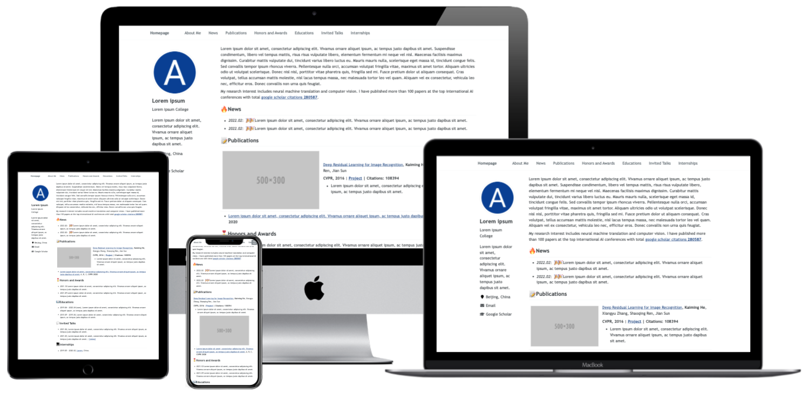

<h1 align="center">
00Dreamer00 Academic Homepage
</h1>

  | [中文文档](./docs/README-zh.md) 

A Modern and Responsive Academic Personal Homepage

Based on the <a href="https://github.com/RayeRen/acad-homepage.github.io">AcadHomepage</a> template.

     
    
     

Some examples:
- [Demo Page](https://rayeren.github.io/acad-homepage.github.io/)
- [Personal Homepage of the author](https://rayeren.github.io/)

## Key Features
- **Automatically update google scholar citations**: using the google scholar crawler and github action, this REPO can update the author citations and publication citations automatically.
- **Support Google analytics**: you can trace the traffics of your homepage by easy configuration.
- **Responsive**: this homepage automatically adjust for different screen sizes and viewports.
- **Beautiful and Simple Design**: this homepage is beautiful and simple, which is very suitable for academic personal homepage.
- **SEO**: search Engine Optimization (SEO) helps search engines find the information you publish on your homepage easily, then rank it against similar websites.

## Quick Start

1. Update the homepage configuration in `_config.yml`:
    1. `title`: the title of your homepage
    1. `description`: a short description for SEO
    1. `repository`: `00Dreamer00/00Dreamer00.github.io`
    1. `author`: your name, affiliation, and social links
    1. Optional: configure Google Analytics and search engine verification keys
1. Add your homepage content in `_pages/about.md`.
    1. You can use HTML + Markdown in this file.
    1. Replace the placeholder sections (News, Publications, Awards, etc.) with your real content.
1. (Optional) Configure the Google Scholar citation crawler:
    1. Find your Google Scholar ID in the URL of your profile (e.g. `https://scholar.google.com/citations?user=SCHOLAR_ID`).
    1. Add the `GOOGLE_SCHOLAR_ID` secret in GitHub Actions.
    1. Enable workflows in the Actions tab so the crawler can update citation stats.
1. Generate a favicon using [favicon-generator](https://redketchup.io/favicon-generator) and replace the files in `images/`.
1. Your page will be published at `https://00Dreamer00.github.io`.

## Debug Locally

1. Clone your REPO to local using `git clone`.
1. Install Jekyll building environment, including `Ruby`, `RubyGems`, `GCC` and `Make` following [the installation guide](https://jekyllrb.com/docs/installation/#requirements).
1. Run `bash run_server.sh` to start Jekyll livereload server.
1. Open http://127.0.0.1:4000 in your browser.
1. If you change the source code of the website, the livereload server will automatically refresh.
1. When you finish the modification of your homepage, `commit` your changings and `push` to your remote REPO using `git` command.

# Acknowledges

- AcadHomepage incorporates Font Awesome, which is distributed under the terms of the SIL OFL 1.1 and MIT License.
- AcadHomepage is influenced by the github repo [mmistakes/minimal-mistakes](https://github.com/mmistakes/minimal-mistakes), which is distributed under the MIT License.
- AcadHomepage is influenced by the github repo [academicpages/academicpages.github.io](https://github.com/academicpages/academicpages.github.io), which is distributed under the MIT License.
